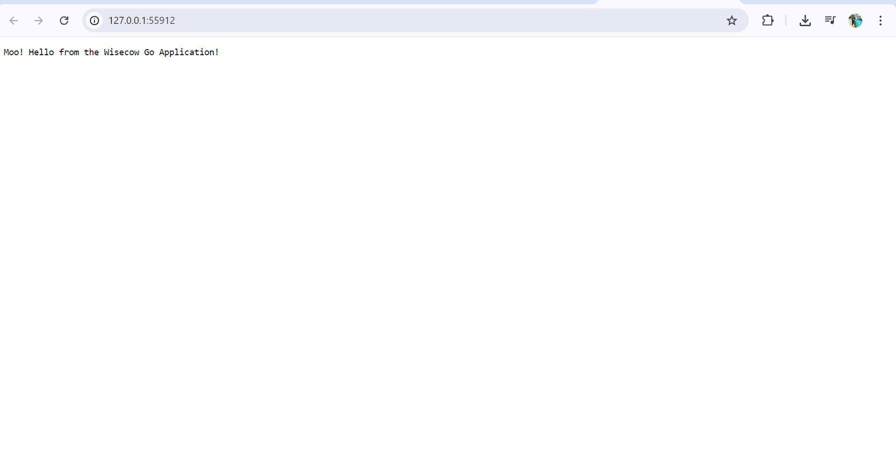

# Wisecow Application: Containerization and Kubernetes Deployment

This project demonstrates the end-to-end process of containerizing a Go web application, setting up an automated CI/CD pipeline with GitHub Actions, and deploying it to a local Kubernetes (Minikube) cluster. This project was completed as part of a technical assessment.

## 🚀 Tech Stack

* **Application:** Go
* **Containerization:** Docker
* **Container Orchestration:** Kubernetes (Minikube)
* **CI/CD Automation:** GitHub Actions

## 📁 Repository Structure

.
├── .github/workflows/  # Contains the CI/CD pipeline configuration
│   └── ci-cd-pipeline.yaml
├── k8s/                # Contains Kubernetes manifest files
│   ├── deployment.yaml
│   └── service.yaml
├── Dockerfile          # A multi-stage Dockerfile for a small, secure image
├── go.mod              # Go module file for dependency management
├── main.go             # The Go application source code
└── wisecow-output.png  # Screenshot of the final running application


## ⚙️ How to Run This Project

### Prerequisites
* [Docker Desktop](https://www.docker.com/products/docker-desktop/)
* [Minikube](https://minikube.sigs.k8s.io/docs/start/)
* [kubectl](https://kubernetes.io/docs/tasks/tools/install-kubectl/)

### Steps
1.  **Clone the repository:**
    ```bash
    git clone [https://github.com/Krishna-Vallamsetty/wisecow.git](https://github.com/Krishna-Vallamsetty/wisecow.git)
    cd wisecow
    ```

2.  **Start your local Kubernetes cluster:**
    ```bash
    minikube start
    ```

3.  **Deploy the application to the cluster:** The `deployment.yaml` is pre-configured to use the public Docker image `krishna2317/wisecow:latest`.
    ```bash
    kubectl apply -f k8s/
    ```

4.  **Verify the deployment:** Wait a minute for the image to be pulled, then check that the pods are running.
    ```bash
    kubectl get pods
    ```

5.  **Access the application:**
    ```bash
    minikube service wisecow-service
    ```

### Expected Output
You should see the following message in your browser:



## 🤖 CI/CD Pipeline

This project features a fully automated Continuous Integration (CI) pipeline using GitHub Actions.

* **Trigger:** The workflow is automatically triggered on every `git push` to the `main` branch.
* **Process:**
    1.  The code is checked out.
    2.  The workflow securely logs in to Docker Hub using repository secrets.
    3.  A new Docker image is built using the `Dockerfile`.
    4.  The newly built image is tagged and pushed to the Docker Hub repository at `krishna2317/wisecow:latest`.

---
